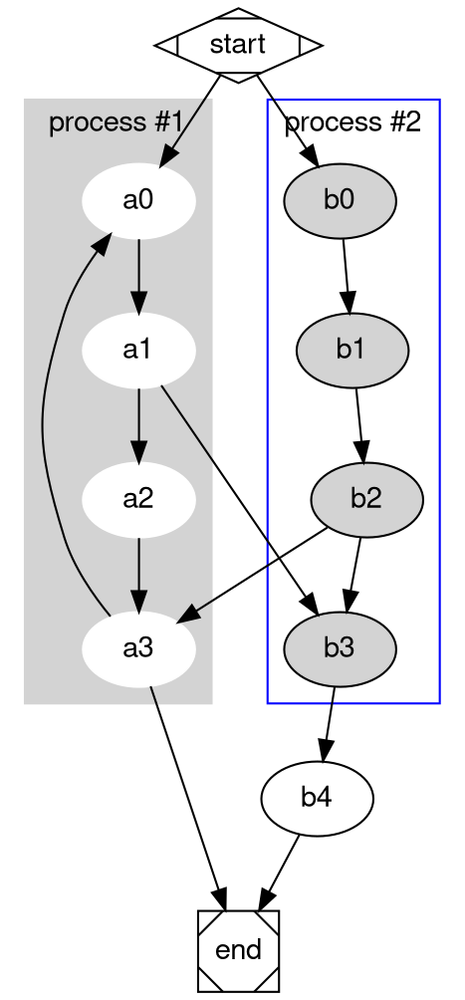

# Graphviz Introduction

:::subtitle
Learn how to use graphviz diagrams
:::

## Demo

## Setup docs.json
```json docs.json [descHead="Tip" desc="Check out how to setup [Graphviz](https://xyd.dev/docs/guides/integrations/abtesting/abtesting-integrations)."]
{
    "integrations": {
        "diagrams": ["graphviz"]
    }
}
```