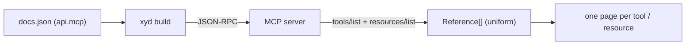

# MCP Server Docs

:::subtitle
Generate browsable API reference for any MCP (Model Context Protocol) server directly from its `tools/list` and `resources/list` endpoints.
:::

Point xyd at the URL of a remote MCP server and it will render one page per
tool (with the tool's `inputSchema` expanded into a property tree) and one
page per resource, alongside any manually-authored content.

## How it works



## Configuration

```jsonc
{
  "api": {
    "mcp": {
      "source": "$MCP_URL",
      "route": "docs/api/mcp",
      "info": { "token": "$MCP_TOKEN" }
    }
  }
}
```

| Field | Purpose |
|-------|---------|
| `source` | MCP server URL (http / https / sse) |
| `route` | Sidebar route prefix the generated pages nest under |
| `info.token` | Bearer token sent as `Authorization: Bearer <token>`; supports `$ENV_VAR` |
| `info.headers` | Additional request headers (e.g. tenant, custom keys) |

## Running this example

```bash
export MCP_URL="https://your-mcp-server.example.com/mcp"
export MCP_TOKEN="$YOUR_TOKEN"   # optional

xyd build
```

The example expects `MCP_URL` to point at a reachable MCP server speaking
the standard JSON-RPC methods `tools/list` and `resources/list`. If it's
unset the API tab will be empty — the rest of the site still builds.
